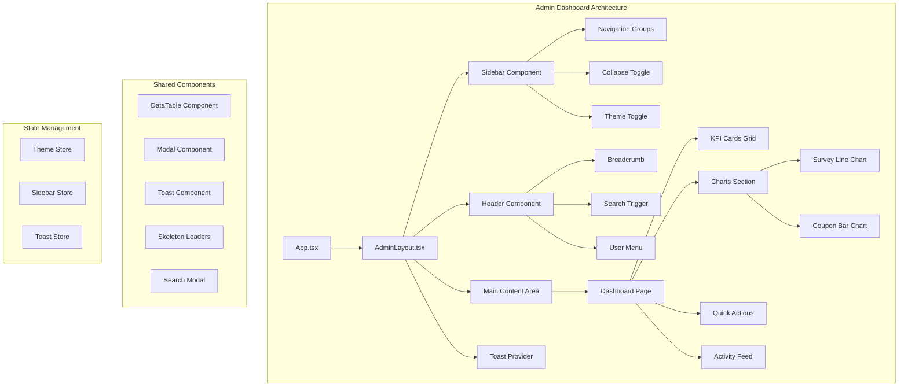

# Design Document: Admin Dashboard Redesign

## Overview

This design document outlines the comprehensive redesign of the SPA Kiosk Admin Dashboard. The new design transforms the current basic interface into a modern, professional dashboard with improved navigation, data visualization, and user experience. The redesign follows a component-based architecture using React with TypeScript, Tailwind CSS for styling, and Recharts for data visualization.

The key design goals are:
- **Modern Visual Design**: Clean, professional aesthetic with consistent spacing and typography
- **Improved Navigation**: Collapsible sidebar replacing horizontal overflow tabs
- **Data-Driven Insights**: Charts and KPIs for quick business intelligence
- **Enhanced Productivity**: Quick actions, global search, and keyboard shortcuts
- **Accessibility First**: Full keyboard navigation and screen reader support
- **Performance Optimized**: Lazy loading, skeleton screens, and smooth animations

## Architecture



## Components and Interfaces

### 1. AdminLayout Component

The main layout wrapper that provides the sidebar, header, and content structure.

```typescript
interface AdminLayoutProps {
  children: ReactNode;
}

interface SidebarState {
  isCollapsed: boolean;
  isMobileOpen: boolean;
}
```

### 2. Sidebar Component

Collapsible navigation sidebar with grouped menu items.

```typescript
interface NavItem {
  id: string;
  label: string;
  icon: ReactNode;
  path: string;
  badge?: number | string;
}

interface NavGroup {
  id: string;
  label: string;
  items: NavItem[];
}

interface SidebarProps {
  isCollapsed: boolean;
  onToggleCollapse: () => void;
  isMobileOpen: boolean;
  onCloseMobile: () => void;
}
```

Navigation Groups:
- **Overview**: Dashboard
- **Content**: Massages, Surveys, Survey Responses
- **Kiosk**: Kiosk Control
- **Coupons**: Issue Coupon, Redemptions, Wallet Lookup
- **System**: Settings, Backup, Logs

### 3. KPI Card Component

Displays key metrics with optional animations and click navigation.

```typescript
interface KPICardProps {
  title: string;
  value: number | string;
  icon: ReactNode;
  trend?: {
    value: number;
    direction: 'up' | 'down' | 'neutral';
  };
  status?: 'normal' | 'warning' | 'critical' | 'success';
  href?: string;
  isLoading?: boolean;
}
```

### 4. Chart Components

Line and bar charts for data visualization using Recharts.

```typescript
interface ChartDataPoint {
  date: string;
  value: number;
  label?: string;
}

interface LineChartProps {
  data: ChartDataPoint[];
  title: string;
  color?: string;
  isLoading?: boolean;
  emptyMessage?: string;
}

interface BarChartProps {
  data: ChartDataPoint[];
  title: string;
  color?: string;
  isLoading?: boolean;
  emptyMessage?: string;
}
```

### 5. Quick Actions Component

Panel with shortcut buttons for common tasks.

```typescript
interface QuickAction {
  id: string;
  label: string;
  icon: ReactNode;
  action: 'navigate' | 'modal';
  target: string;
  variant?: 'primary' | 'secondary' | 'success' | 'warning';
}

interface QuickActionsProps {
  actions: QuickAction[];
  onActionClick: (action: QuickAction) => void;
}
```

### 6. Activity Feed Component

Real-time event feed with navigation.

```typescript
interface ActivityItem {
  id: string;
  type: 'survey' | 'coupon' | 'kiosk' | 'system';
  message: string;
  timestamp: Date;
  href?: string;
  icon?: ReactNode;
}

interface ActivityFeedProps {
  items: ActivityItem[];
  maxItems?: number;
  isLoading?: boolean;
}
```

### 7. DataTable Component

Enhanced table with sorting, filtering, and pagination.

```typescript
interface Column<T> {
  id: string;
  header: string;
  accessor: keyof T | ((row: T) => ReactNode);
  sortable?: boolean;
  width?: string;
}

interface DataTableProps<T> {
  data: T[];
  columns: Column<T>[];
  pageSize?: number;
  searchable?: boolean;
  searchPlaceholder?: string;
  emptyMessage?: string;
  isLoading?: boolean;
  onRowClick?: (row: T) => void;
}
```

### 8. Toast Notification System

```typescript
interface Toast {
  id: string;
  type: 'success' | 'error' | 'warning' | 'info';
  title: string;
  message?: string;
  duration?: number; // 0 for persistent
  dismissible?: boolean;
}

interface ToastContextValue {
  toasts: Toast[];
  addToast: (toast: Omit<Toast, 'id'>) => void;
  removeToast: (id: string) => void;
}
```

### 9. Search Modal Component

Global search with keyboard navigation.

```typescript
interface SearchResult {
  id: string;
  type: 'massage' | 'survey' | 'setting' | 'page';
  title: string;
  description?: string;
  href: string;
  icon?: ReactNode;
}

interface SearchModalProps {
  isOpen: boolean;
  onClose: () => void;
  onSelect: (result: SearchResult) => void;
}
```

### 10. Theme System

```typescript
type Theme = 'light' | 'dark' | 'system';

interface ThemeContextValue {
  theme: Theme;
  resolvedTheme: 'light' | 'dark';
  setTheme: (theme: Theme) => void;
}
```

## Data Models

### Dashboard Data

```typescript
interface DashboardData {
  kpis: {
    todaySurveys: number;
    totalSurveys: number;
    activeCoupons: number;
    pendingRedemptions: number;
    kioskOnline: boolean;
    kioskLastSeen: Date | null;
  };
  surveyTrend: ChartDataPoint[];
  couponTrend: ChartDataPoint[];
  recentActivity: ActivityItem[];
  alerts: Alert[];
}

interface Alert {
  id: string;
  severity: 'info' | 'warning' | 'critical';
  title: string;
  message: string;
  timestamp: Date;
  href?: string;
}
```

### Navigation State

```typescript
interface NavigationState {
  currentPath: string;
  breadcrumbs: BreadcrumbItem[];
  sidebarCollapsed: boolean;
  mobileMenuOpen: boolean;
}

interface BreadcrumbItem {
  label: string;
  href?: string;
}
```

## Correctness Properties

*A property is a characteristic or behavior that should hold true across all valid executions of a system-essentially, a formal statement about what the system should do. Properties serve as the bridge between human-readable specifications and machine-verifiable correctness guarantees.*

### Property 1: Sidebar Collapse State Toggle
*For any* sidebar state (collapsed or expanded), clicking the collapse toggle SHALL result in the opposite state being applied.
**Validates: Requirements 1.2**

### Property 2: Responsive Layout Columns
*For any* viewport width, the dashboard SHALL display the correct number of columns: 3 columns for width >= 1024px, 2 columns for 768-1023px, and 1 column for width < 768px.
**Validates: Requirements 7.1, 7.2, 7.3**

### Property 3: Theme Persistence Round-Trip
*For any* theme selection (light, dark, system), saving to localStorage and reloading the page SHALL restore the same theme.
**Validates: Requirements 6.1, 6.2, 6.3**

### Property 4: KPI Card Navigation
*For any* KPI card with a defined href, clicking the card SHALL navigate to the correct destination page.
**Validates: Requirements 2.3**

### Property 5: Quick Action Completion Feedback
*For any* quick action that completes successfully, the system SHALL display a toast notification confirming the action.
**Validates: Requirements 4.3**

### Property 6: Activity Feed Ordering
*For any* set of activity items, the feed SHALL display them in reverse chronological order with the newest item first.
**Validates: Requirements 5.1, 5.2**

### Property 7: Table Sorting Correctness
*For any* sortable column in a data table, clicking the header SHALL sort the data in ascending order, and clicking again SHALL sort in descending order.
**Validates: Requirements 8.2**

### Property 8: Table Pagination Threshold
*For any* data table with more than 10 rows, pagination controls SHALL be displayed; for 10 or fewer rows, pagination SHALL not be displayed.
**Validates: Requirements 8.3**

### Property 9: Search Results Relevance
*For any* search query, all returned results SHALL contain the query string in either the title or description (case-insensitive).
**Validates: Requirements 11.2**

### Property 10: Search Result Navigation
*For any* search result selection, the system SHALL navigate to the correct page and close the search modal.
**Validates: Requirements 11.4**

### Property 11: Breadcrumb Path Accuracy
*For any* nested page, the breadcrumb SHALL display the correct hierarchical path from dashboard to current page.
**Validates: Requirements 10.1**

### Property 12: Toast Notification Stacking
*For any* sequence of toast notifications, they SHALL be stacked vertically with the most recent notification on top.
**Validates: Requirements 9.3**

### Property 13: Critical Toast Persistence
*For any* critical alert toast, it SHALL remain visible until explicitly dismissed by the user.
**Validates: Requirements 9.1**

### Property 14: Skeleton Loading Display
*For any* data-loading state, the system SHALL display skeleton loaders that match the expected content dimensions.
**Validates: Requirements 12.1**

### Property 15: Keyboard Focus Traversal
*For any* page, all interactive elements SHALL be reachable via Tab key navigation in a logical document order.
**Validates: Requirements 13.1**

### Property 16: Focus Indicator Visibility
*For any* focused interactive element, a visible focus indicator SHALL be displayed.
**Validates: Requirements 13.2**

### Property 17: Modal Focus Trapping
*For any* open modal, Tab key navigation SHALL cycle only through elements within the modal until it is closed.
**Validates: Requirements 13.5**

### Property 18: Mobile Touch Target Size
*For any* interactive element on mobile viewport (< 768px), the touch target SHALL be at least 44x44 pixels.
**Validates: Requirements 7.5**

### Property 19: Dark Mode Contrast Compliance
*For any* text element in dark mode, the contrast ratio against its background SHALL be at least 4.5:1.
**Validates: Requirements 6.5**

### Property 20: Warning KPI Styling
*For any* KPI card in warning state, the card SHALL display with amber border and warning icon.
**Validates: Requirements 2.5**

## Error Handling

### Network Errors
- Display inline error messages with retry buttons
- Show toast notifications for failed operations
- Maintain last known good state while retrying

### Loading States
- Show skeleton loaders for initial page loads
- Show inline spinners for button actions
- Display timeout message after 10 seconds with retry option

### Validation Errors
- Highlight invalid form fields with red border
- Display error messages below fields
- Prevent form submission until errors are resolved

### Empty States
- Display helpful messages when no data exists
- Provide action buttons to create first item
- Show illustrations for visual appeal

## Testing Strategy

### Dual Testing Approach

This feature requires both unit tests and property-based tests to ensure comprehensive coverage.

#### Unit Tests
Unit tests verify specific examples and edge cases:
- Component rendering with various props
- User interaction handlers (clicks, keyboard events)
- API hook behavior with mocked responses
- Theme switching and persistence
- Responsive breakpoint behavior

#### Property-Based Tests
Property-based tests verify universal properties across all inputs using **fast-check** library:
- Sidebar collapse state always toggles correctly
- Theme persistence round-trip always works
- Table sorting produces correctly ordered results
- Search results always contain query string
- Toast stacking order is always newest-first

### Testing Framework
- **Unit Tests**: Vitest with React Testing Library
- **Property Tests**: fast-check with Vitest
- **E2E Tests**: Puppeteer for visual regression and user flows

### Test File Organization
```
frontend/src/
├── components/
│   └── admin/
│       ├── Sidebar.tsx
│       ├── Sidebar.test.tsx
│       ├── KPICard.tsx
│       ├── KPICard.test.tsx
│       ├── DataTable.tsx
│       ├── DataTable.test.tsx
│       └── ...
├── pages/
│   └── admin/
│       ├── DashboardPage.tsx
│       └── DashboardPage.test.tsx
└── lib/
    ├── theme.ts
    ├── theme.test.ts
    └── theme.property.test.ts
```

### Property Test Annotations
Each property-based test must include a comment referencing the design document:
```typescript
// **Feature: admin-dashboard-redesign, Property 3: Theme Persistence Round-Trip**
```

### Test Configuration
- Property tests should run minimum 100 iterations
- Use fast-check's `fc.configureGlobal({ numRuns: 100 })`
- Seed random generators for reproducibility

## Page-Specific Designs

### Dashboard Page (Redesigned)
The main dashboard with KPI cards, charts, quick actions, and activity feed as described above.

### Massages Management Pages

#### Massages List Page
```typescript
interface MassagesPageDesign {
  layout: 'sidebar-content';
  components: {
    header: {
      title: string;
      subtitle: string;
      actions: ['Add New Massage', 'Bulk Layout'];
    };
    filters: {
      search: TextInput;
      layoutFilter: Select<'all' | 'price-list' | 'info-tags' | 'media-focus' | 'immersive'>;
      statusFilter: Select<'all' | 'featured' | 'campaign'>;
    };
    table: DataTable<Massage>;
    emptyState: EmptyStateComponent;
  };
}
```

Features:
- Card-based grid view option (toggle between table/grid)
- Drag-and-drop reordering with visual feedback
- Inline quick actions (edit, delete, duplicate)
- Thumbnail preview for media
- Bulk selection and actions
- Filter chips showing active filters

#### Massage Create/Edit Page
```typescript
interface MassageFormPageDesign {
  layout: 'two-column';
  leftColumn: {
    sections: [
      'Basic Information',
      'Description',
      'Sessions & Pricing',
      'Tags & Categories'
    ];
  };
  rightColumn: {
    sections: [
      'Media Upload',
      'Preview Card',
      'Layout Template Selection',
      'Publishing Options'
    ];
  };
  footer: {
    actions: ['Cancel', 'Save Draft', 'Save & Publish'];
  };
}
```

Features:
- Live preview card showing how massage will appear in kiosk
- Drag-and-drop media upload with progress
- Rich text editor for long description
- Session builder with add/remove rows
- Tag autocomplete with suggestions
- Layout template visual selector with previews
- Unsaved changes warning on navigation

### Surveys Management Pages

#### Surveys List Page
```typescript
interface SurveysPageDesign {
  layout: 'sidebar-content';
  components: {
    header: {
      title: string;
      actions: ['Create New Survey'];
    };
    tabs: ['All Surveys', 'Satisfaction', 'Discovery'];
    cards: SurveyCard[];
    emptyState: EmptyStateComponent;
  };
}

interface SurveyCard {
  title: string;
  type: 'satisfaction' | 'discovery';
  questionCount: number;
  responseCount: number;
  lastModified: Date;
  actions: ['View Analytics', 'Edit', 'Duplicate', 'Delete'];
}
```

Features:
- Card-based layout with survey previews
- Response count badges
- Quick analytics preview (mini chart)
- Duplicate survey functionality
- Active survey indicator

#### Survey Editor Page
```typescript
interface SurveyEditorPageDesign {
  layout: 'builder';
  leftPanel: {
    questionTypes: ['Rating', 'Text', 'Multiple Choice', 'Yes/No'];
    dragSource: true;
  };
  centerPanel: {
    surveyCanvas: {
      header: SurveyHeaderEditor;
      questions: DraggableQuestionList;
      addQuestionButton: Button;
    };
  };
  rightPanel: {
    questionSettings: QuestionSettingsPanel;
    surveySettings: SurveySettingsPanel;
  };
  footer: {
    actions: ['Preview', 'Save Draft', 'Publish'];
  };
}
```

Features:
- Drag-and-drop question builder
- Question type palette on left
- Live preview mode (mobile/tablet/desktop)
- Question settings panel (required, validation, etc.)
- Conditional logic builder
- Reorder questions via drag
- Duplicate/delete questions inline
- Auto-save with version history

#### Survey Responses Page
```typescript
interface SurveyResponsesPageDesign {
  layout: 'sidebar-content';
  components: {
    header: {
      title: string;
      surveySelector: Select<Survey>;
      dateRange: DateRangePicker;
      exportButton: Button;
    };
    summary: ResponseSummaryCards;
    table: DataTable<SurveyResponse>;
    detailModal: ResponseDetailModal;
  };
}
```

Features:
- Survey selector dropdown
- Date range filter
- Export to CSV/Excel
- Response summary cards (total, today, average rating)
- Expandable response rows
- Response detail modal with all answers
- Alert highlighting for low ratings

#### Survey Analytics Page
```typescript
interface SurveyAnalyticsPageDesign {
  layout: 'dashboard';
  components: {
    header: {
      title: string;
      surveySelector: Select<Survey>;
      dateRange: DateRangePicker;
    };
    kpis: [
      'Total Responses',
      'Average Rating',
      'Completion Rate',
      'Response Trend'
    ];
    charts: [
      'Responses Over Time (Line)',
      'Rating Distribution (Bar)',
      'Question Breakdown (Horizontal Bar)',
      'Completion Funnel'
    ];
    insights: AlertsAndInsightsPanel;
  };
}
```

Features:
- Interactive charts with drill-down
- Question-by-question breakdown
- Sentiment analysis for text responses
- Comparison with previous period
- Export analytics report

### Kiosk Control Page
```typescript
interface KioskControlPageDesign {
  layout: 'centered-card';
  components: {
    statusCard: {
      kioskStatus: 'online' | 'offline';
      currentMode: KioskMode;
      lastSeen: Date;
      uptime: Duration;
    };
    modeSelector: {
      modes: [
        { id: 'digital-menu', icon: MenuIcon, label: 'Digital Menu' },
        { id: 'survey', icon: ClipboardIcon, label: 'Survey Mode' },
        { id: 'google-qr', icon: QRCodeIcon, label: 'Google Review QR' }
      ];
      visualCards: true;
    };
    surveySelector: ConditionalSelect<Survey>;
    previewPanel: KioskPreviewFrame;
    actions: ['Apply Changes', 'Refresh Kiosk'];
  };
}
```

Features:
- Visual mode selector with icons and descriptions
- Live kiosk preview iframe
- Real-time status updates
- Quick refresh button
- Mode change confirmation dialog

### Coupon Management Pages

#### Issue Coupon Page
```typescript
interface IssueCouponPageDesign {
  layout: 'centered-form';
  components: {
    form: {
      phoneInput: PhoneInputWithValidation;
      generateButton: Button;
    };
    result: {
      qrCode: QRCodeDisplay;
      tokenDisplay: TokenDisplay;
      copyButton: Button;
      printButton: Button;
    };
    recentTokens: RecentTokensList;
  };
}
```

Features:
- Phone number validation with country code
- Large QR code display
- Copy token to clipboard
- Print-friendly QR view
- Recent tokens history

#### Coupon Redemptions Page
```typescript
interface CouponRedemptionsPageDesign {
  layout: 'sidebar-content';
  components: {
    header: {
      title: string;
      dateRange: DateRangePicker;
      statusFilter: Select<'all' | 'pending' | 'completed' | 'expired'>;
    };
    stats: [
      'Total Redemptions',
      'Pending',
      'Completed Today',
      'Expired'
    ];
    table: DataTable<Redemption>;
    detailModal: RedemptionDetailModal;
  };
}
```

Features:
- Status badges with colors
- Quick approve/reject actions
- Customer phone lookup
- Redemption history timeline
- Export functionality

#### Wallet Lookup Page
```typescript
interface WalletLookupPageDesign {
  layout: 'search-results';
  components: {
    searchForm: {
      phoneInput: PhoneInputWithValidation;
      searchButton: Button;
    };
    results: {
      customerInfo: CustomerInfoCard;
      couponBalance: BalanceDisplay;
      transactionHistory: TransactionTimeline;
      actions: ['Issue Coupon', 'Adjust Balance'];
    };
    emptyState: SearchEmptyState;
  };
}
```

Features:
- Phone number search
- Customer coupon balance display
- Transaction history timeline
- Manual balance adjustment (admin)
- Issue coupon directly

### Settings Page
```typescript
interface SettingsPageDesign {
  layout: 'tabbed-sections';
  tabs: [
    {
      id: 'timing',
      label: 'Timing Settings',
      fields: ['slideshowTimeout', 'surveyTimeout', 'qrDisplayDuration'];
    },
    {
      id: 'theme',
      label: 'Kiosk Theme',
      fields: ['themeSelector'];
    },
    {
      id: 'google-review',
      label: 'Google Review',
      fields: ['reviewUrl', 'reviewTitle', 'reviewDescription'];
    },
    {
      id: 'google-sheets',
      label: 'Google Sheets',
      fields: ['sheetId', 'sheetName', 'credentials', 'testConnection'];
    },
    {
      id: 'security',
      label: 'Security',
      fields: ['changePassword', 'sessionTimeout'];
    }
  ];
  footer: {
    actions: ['Reset to Defaults', 'Save Changes'];
  };
}
```

Features:
- Tabbed navigation for settings categories
- Inline validation
- Test connection button for integrations
- Reset to defaults option
- Save confirmation

### Backup Page
```typescript
interface BackupPageDesign {
  layout: 'sidebar-content';
  components: {
    header: {
      title: string;
      actions: ['Create Backup Now'];
    };
    status: {
      lastBackup: Date;
      backupSize: string;
      autoBackupEnabled: boolean;
    };
    backupList: DataTable<Backup>;
    restoreModal: RestoreConfirmationModal;
  };
}
```

Features:
- One-click backup creation
- Backup list with download links
- Restore confirmation with warnings
- Auto-backup schedule settings
- Backup size and date info

### System Logs Page
```typescript
interface SystemLogsPageDesign {
  layout: 'full-width';
  components: {
    header: {
      title: string;
      filters: {
        level: Select<'all' | 'info' | 'warning' | 'error'>;
        dateRange: DateRangePicker;
        search: TextInput;
      };
      actions: ['Export Logs', 'Clear Logs'];
    };
    logViewer: {
      virtualizedList: true;
      syntaxHighlighting: true;
      expandableRows: true;
    };
    stats: {
      errorCount: number;
      warningCount: number;
      lastError: Date;
    };
  };
}
```

Features:
- Virtualized log list for performance
- Log level filtering with color coding
- Full-text search
- Expandable log entries
- Export to file
- Auto-refresh toggle

### Login Page
```typescript
interface LoginPageDesign {
  layout: 'centered-card';
  components: {
    logo: AppLogo;
    form: {
      usernameInput: TextInput;
      passwordInput: PasswordInput;
      rememberMe: Checkbox;
      submitButton: Button;
    };
    footer: {
      version: string;
      helpLink: Link;
    };
  };
  background: 'gradient' | 'image';
}
```

Features:
- Clean, centered login card
- Gradient or image background
- Remember me option
- Password visibility toggle
- Loading state on submit
- Error message display
- Version number in footer

## Shared UI Components Library

### Form Components
```typescript
// Text Input with label, validation, and helper text
interface TextInputProps {
  label: string;
  value: string;
  onChange: (value: string) => void;
  placeholder?: string;
  helperText?: string;
  error?: string;
  required?: boolean;
  disabled?: boolean;
  type?: 'text' | 'email' | 'password' | 'number' | 'tel';
  leftIcon?: ReactNode;
  rightIcon?: ReactNode;
}

// Select dropdown
interface SelectProps<T> {
  label: string;
  value: T;
  onChange: (value: T) => void;
  options: { value: T; label: string }[];
  placeholder?: string;
  error?: string;
  required?: boolean;
  disabled?: boolean;
  searchable?: boolean;
}

// Date Range Picker
interface DateRangePickerProps {
  startDate: Date | null;
  endDate: Date | null;
  onChange: (range: { start: Date; end: Date }) => void;
  presets?: { label: string; range: { start: Date; end: Date } }[];
}
```

### Feedback Components
```typescript
// Empty State
interface EmptyStateProps {
  icon: ReactNode;
  title: string;
  description: string;
  action?: {
    label: string;
    onClick: () => void;
  };
}

// Confirmation Dialog
interface ConfirmDialogProps {
  isOpen: boolean;
  title: string;
  message: string;
  confirmLabel?: string;
  cancelLabel?: string;
  variant?: 'danger' | 'warning' | 'info';
  onConfirm: () => void;
  onCancel: () => void;
}

// Loading Overlay
interface LoadingOverlayProps {
  isLoading: boolean;
  message?: string;
  children: ReactNode;
}
```

### Layout Components
```typescript
// Page Header
interface PageHeaderProps {
  title: string;
  subtitle?: string;
  actions?: ReactNode;
  breadcrumbs?: BreadcrumbItem[];
}

// Card
interface CardProps {
  title?: string;
  subtitle?: string;
  actions?: ReactNode;
  children: ReactNode;
  padding?: 'none' | 'sm' | 'md' | 'lg';
  hover?: boolean;
  onClick?: () => void;
}

// Tabs
interface TabsProps {
  tabs: { id: string; label: string; icon?: ReactNode }[];
  activeTab: string;
  onChange: (tabId: string) => void;
  children: ReactNode;
}
```

## Visual Design Specifications

### Color Palette

#### Light Mode
- Background: `#f9fafb` (gray-50)
- Surface: `#ffffff` (white)
- Primary: `#0284c7` (sky-600)
- Text Primary: `#111827` (gray-900)
- Text Secondary: `#6b7280` (gray-500)
- Border: `#e5e7eb` (gray-200)
- Success: `#059669` (emerald-600)
- Warning: `#d97706` (amber-600)
- Error: `#dc2626` (red-600)

#### Dark Mode
- Background: `#111827` (gray-900)
- Surface: `#1f2937` (gray-800)
- Primary: `#38bdf8` (sky-400)
- Text Primary: `#f9fafb` (gray-50)
- Text Secondary: `#9ca3af` (gray-400)
- Border: `#374151` (gray-700)
- Success: `#34d399` (emerald-400)
- Warning: `#fbbf24` (amber-400)
- Error: `#f87171` (red-400)

### Typography
- Font Family: Inter, system-ui, sans-serif
- Headings: font-semibold
- Body: font-normal
- Scale: text-xs (12px), text-sm (14px), text-base (16px), text-lg (18px), text-xl (20px), text-2xl (24px)

### Spacing
- Base unit: 4px
- Component padding: 16px (p-4)
- Section gaps: 24px (gap-6)
- Card padding: 24px (p-6)

### Shadows
- Card shadow: `shadow-sm` (light), `shadow-md` (elevated)
- Modal shadow: `shadow-xl`
- Dropdown shadow: `shadow-lg`

### Border Radius
- Buttons: `rounded-lg` (8px)
- Cards: `rounded-xl` (12px)
- Inputs: `rounded-md` (6px)
- Badges: `rounded-full`

### Animations
- Transitions: 200ms ease-in-out
- Sidebar collapse: 200ms
- Toast enter/exit: 200ms
- Number counting: 500ms
- Skeleton pulse: 1.5s infinite
